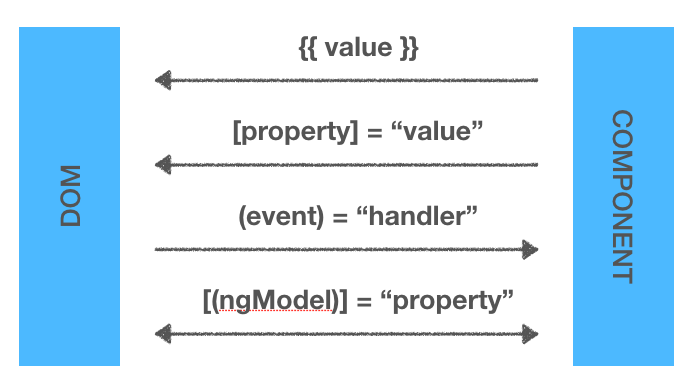

# Angular


---------------------------------------------------------

## 環境建構


清除npm cache

```
npm cache clean -f
```


將 node.js 更新到最新

```
npm update
npm install
```
執行 npm install，如果後面不加套件名稱的話

npm 會當作是你想把 package.json 上現在缺的 Dependency 都裝回來


更新工作區的Angular CLI（本地）

```
npm install --save -dev @angular/core@latest
npm install --save -dev @angular/cli@latest
```

```
npm audit
```


確認 Angular 目前版本

```
ng --version
```


獲取需要升級的所有依賴項的列表

```
ng update
```


```
ng update @angular/cli @angular/core
```


遇到 "Repository is not clean. Please commit or stash any changes before updating."

```
ng update @angular/cli @angular/core --allow-dirty
```


Angular CLI 當然也有提供指令讓我們可以很輕鬆地就將檔案編譯並打包出來，那就是： ng build 。而編譯出來的檔案會放在根目錄的 dist 資料夾內。

```
ng build
```
* --prod － 將會使用 Production Mode 來編譯與打包專案。

* --source-map － 打包出來的檔案會含有 source map 的檔案 （不知道什麼是 source map 的朋友可以參考保哥的文章） 。


```
ng serve
```
* --open － 當我們指令單純只下 ng serve 的時候，我們得手動開啟瀏覽器並在網址列輸入 localhost:4200 ，才能在頁面上看到我們的頁面。但加上此參數會讓 Angular CLI 在準備好之後，直接幫我們開啟頁面，不用再自己手動開啟。

* --port － 為什麼一定要輸入 localhost:4200 才能看到頁面呢？我可以輸入 localhost:4201 或 localhost:5487 嗎？！

當然可以！之所以在 4200 才能看到頁面的關係是因為，在我們沒有使用這個參數並指定其值時，Angular CLI 幫我們啟動的 Web-Server 就只有在 port 是 4200 時才能看到頁面 （如果不知道什麼是 port 的話，可以參考維基百科的說明） ，且如果已經有應用程式已經在使用該 port 時，是不能再開啟的。


Angular 預設 port 是 4200

```
http://localhost:4200/
```


```
tsconfig.json
"angularCompilerOptions": {
"enableIvy": false,
}
```


有些時候會出現「因為這個系統上已停用指令碼執行，所以無法載入…」的問題，之所以會出現這個問題是因為 Windows 在執行政策上會有一定的安全性設置，其主要是避免你執行了一些不安全的指令來源，例如不小心執行了病毒指令等，因此在一般的狀況下 Windows 的執行政策 (Set-ExecutionPolicy) 預設是 Restricted，也就是「限制原則」。

而主要會發生這個問題通常都是在 Windows 10 的 PowerShell 上，官方似乎也沒有說明大概從哪一個版本開始 PowerShell 的執行原則就預設調整成 Restricted，因此若你是一名工程師的話，就會需要調整一下這個選項。

準備解放功能之前可以先輸入以下指令查看目前執行原則，加上參數 -List 查看更詳細一點。

```
Get-ExecutionPolicy -List
```


接下來就是解決「因為這個系統上已停用指令碼執行，所以無法載入…」的問題，只需要在終端機輸入以下指令即可

```
Set-ExecutionPolicy RemoteSigned
```


---------------------------------------------------------

## Angular 資料綁定


在 Angular 中，資料綁定的方式大致上可以分成以下四種：




第一種是最簡單的插值表達式。箭頭由右到左代表資料的流向是將 Component 裡的資料放到 DOM 裡；而只有一個箭頭則代表單向綁定。

第二種方式我們稱之為屬性綁定。箭頭一樣是由右至左，且只有一個箭頭。這個方式是透過在 HTML 的元素上加上 [propertyName] 來達成資料綁定的目的。

第三種方式叫做事件綁定。箭頭由左到右，表示資料是從 DOM 流向 Component；只有一個箭頭，一樣是單向綁定。從圖中其實就看得出來，此方式是透過 event 與 handler 來達到資料傳遞的目的，只要在 HTML 的元素上加上 (event)="handler($event)" 即可在 Component 裡取得傳回來的資料。

最後一種綁定方式比較特別，兩個箭頭表示這個綁定方式是雙向綁定，其主要是透過 Angular 裡的一個叫做 Template-Driven Form 的方式來達成雙向綁定的效果。使用方式是在 HTML 元素上加上 [(ngModel)]="property" 即可從 Component 將資料綁定進去，且在使用者有修改其值時，即時將資料設定回去。


下面這張圖展示了這些基礎部分之間是如何關聯起來的。


---------------------------------------------------------

## 參考


30 天精通 Git 版本控管
https://github.com/doggy8088/Learn-Git-in-30-days


Angular 深入淺出三十天 系列
https://ithelp.ithome.com.tw/users/20090728/ironman/1600


Angular 大師之路 系列
https://ithelp.ithome.com.tw/users/20020617/ironman/1630


npm 基本指令
http://dreamerslab.com/blog/tw/npm-basic-commands/


解決 Windows 上輸入指令出現「因為這個系統上已停用指令碼執行，所以無法載入...」的問題

https://hsiangfeng.github.io/other/20200510/1067127387/


